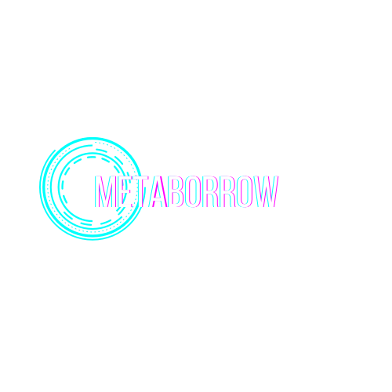

## METABORROW

MetaBorrow’s mission is to accelerate the transition of crypto and non-crypto games towards a decentralised future by lending and borrowing the gaming assets using the staking mechanisms.

We are committed to empowering the gaming experience by helping gamers generate income through their gaming assets and save money at the same time by letting gamers rent in-game assets instead of buying them. 
MetaBorrow unlocks an untapped secondary market around in-game assets where both the game developers and gamers generate profit through an open, transparent and decentralised revenue sharing model on every transactions done in an in-game asset on the platform.

Welcome to the Gaming DeFi future!
